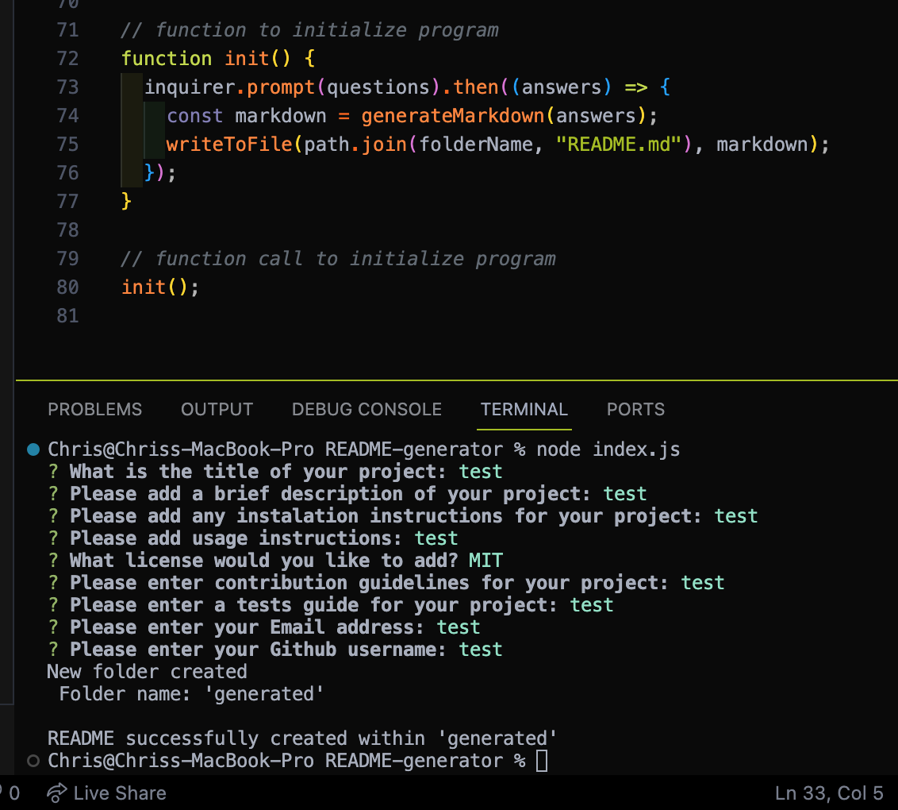

# ReadMe Generator

## Description

By using this README generator, developers can save time and ensure consistency in the documentation of their projects. The generator prompts the user to input specific details about their project, and then generates a formatted README file based on the information provided.

- [Walkthrough video](https://drive.google.com/file/d/1MWRI24i1tsWP5wAGrbH7lgTkrurZIhji/view)

## Table of Contents

- [Installation](#installation)
- [Usage](#usage)
- [License](#license)
- [Questions](#questions)

## Installation

To install the README Generator, you will first need to have Node.JS installed on your machine.

- Step 1
  - Clone the repo onto your local machine.

* Step 2
  - Run [ npm i ] from the root of the README Generator to install any dependencies.

## Usage

- Step 1
  - Open the terminal from the root of the README Generator.

* Step 2

  - Run the command [ node index.js ].
  - Enter the information when prompted.

* Step 3
  - A new folder 'generated' will be created containing the generated README file.

## Screenshot

## License

N/A

## Questions

You can check out my Github [HERE](https://github.com/chrisS-88).

If you have any questions, feel free to reach out to me [HERE](mailto:chrissmart920@gmail.com).
